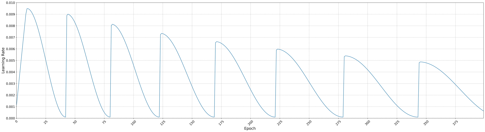
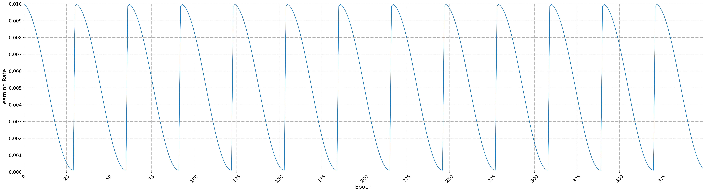
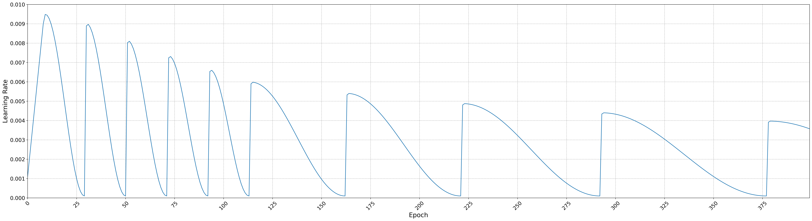
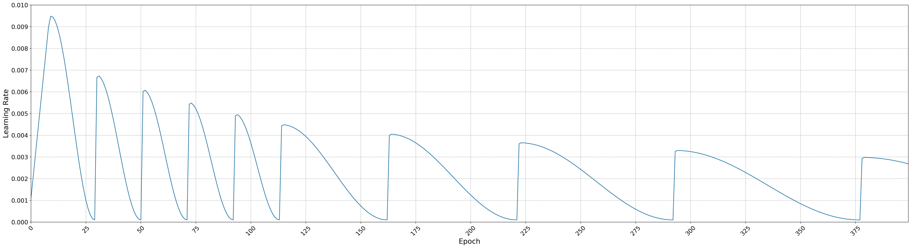

# Implementation of a custom Stochastic Gradient Descent with Warm Restarts (SGDR) 
This repository includes a Keras callback to be used in training that allows implementation of cyclical learning rate policies, as detailed in Leslie Smith's paper Cyclical Learning Rates for Training Neural Networks arXiv:1506.01186v4.

A cyclical learning rate is a policy of learning rate adjustment that increases the learning rate off a base value in a cyclical nature. Typically the frequency of the cycle is constant, but the amplitude is often scaled dynamically at either each cycle or each mini-batch iteration.

## Args
## Parameters:
- min_lr (float): Minimum learning rate during the entire training.
- max_lr (float): Maximum learning rate before each restart.
- steps_per_epoch (int): Number of steps per epoch. 
                            Is equal to number of training samples divided by batch size. = ceil(num_samples / batch_size)

- first_lr_drop_mult (float): Drop factor for learning rate after the first warmup.
- general_lr_decay (float): Decay factor for learning rate.

- if_warmup_cooldown_start (int): 0 for warmup start, 0 for cooldown start. Decide whether to start with warmup or cooldown step.

- init_cooldown_length (int): Initial number of epochs in a cooldown step.
- init_cooldown_mult_factor (float): Factor to grow the cooldown step length.

- warmup_length (int): Number of epochs in warmup period.
- warmup_mult_factor (float): Factor to grow the warmup length.
- if_no_post_warmup (int): 0 for no post warmup, 1 for post warmup. 
                            Decide whether to have post warmup step, i.e. after first warmup.

- number_of_cooldowns_before_switch (int): Epoch to switch to a new cooldown length.
- new_cooldown_length (int): New cooldown length after switch epoch.
- new_cooldown_mult_factor (float): Factor to grow the new cooldown length.

- verbose (int): Verbosity mode.

## References
  1. **CyclicalLR:** Cyclical Learning Rates for Training Neural Networks: https://arxiv.org/pdf/1506.01186.pdf;
  2. **CosineLR:** SGDR: STOCHASTIC GRADIENT DESCENT WITH WARM RESTARTS: https://arxiv.org/pdf/1608.03983.pdf;

## Examples

### 1. Cosine annealing with initial warmup, decaying max-lr and increasing warmup length. Fixed length for cycles.

```python
sgdr = SGDRScheduler_custom(
    min_lr=0.0001, 
    max_lr=0.01, 
    steps_per_epoch=68,
    first_lr_drop_mult=1,
    general_lr_decay=0.95, 
    if_warmup_cooldown_start=0,
    init_cooldown_length=30,
    init_cooldown_mult_factor=1.1,
    warmup_length=10,
    warmup_mult_factor=1.2,
    if_no_post_warmup=1,
    number_of_cooldowns_before_switch=0,
    new_cooldown_length=30,
    new_cooldown_mult_factor=1.1,
    )
```



### 2. Cosine annealing without initial warmup and constant max-lr. Fixed length for cycles.

```python
sgdr = SGDRScheduler_custom(
    min_lr=0.0001, 
    max_lr=0.01, 
    steps_per_epoch=68,
    first_lr_drop_mult=1,
    general_lr_decay=1, 
    if_warmup_cooldown_start=1,
    init_cooldown_length=30,
    init_cooldown_mult_factor=1,
    warmup_length=10,
    warmup_mult_factor=1,
    if_no_post_warmup=0,
    number_of_cooldowns_before_switch=0,
    new_cooldown_length=30,
    new_cooldown_mult_factor=1,
    )
```



### 3. Cosine annealing with initial warmup, 5 initial small cycles and decaying max-lr. Fixed length for initial small cycles and increasing length for followup cycles.

```python
sgdr = SGDRScheduler_custom(
    min_lr=0.0001, 
    max_lr=0.01, 
    steps_per_epoch=68,
    first_lr_drop_mult=1,
    general_lr_decay=0.95, 
    if_warmup_cooldown_start=0,
    init_cooldown_length=20,
    init_cooldown_mult_factor=1,
    warmup_length=10,
    warmup_mult_factor=1,
    if_no_post_warmup=0,
    number_of_cooldowns_before_switch=5,
    new_cooldown_length=40,
    new_cooldown_mult_factor=1.2,
    )
```




### 4. Cosine annealing with minimum initial warmup, 5 initial small cycles and decaying max-lr. Fixed length for initial small cycles and increasing length for followup cycles. First cycle has 75% reduced max-lr.

```python
sgdr = SGDRScheduler_custom(
    min_lr=0.0001, 
    max_lr=0.01, 
    steps_per_epoch=68,
    first_lr_drop_mult=0.75,
    general_lr_decay=0.95, 
    if_warmup_cooldown_start=0,
    init_cooldown_length=20,
    init_cooldown_mult_factor=1,
    warmup_length=1,
    warmup_mult_factor=1,
    if_no_post_warmup=0,
    number_of_cooldowns_before_switch=5,
    new_cooldown_length=40,
    new_cooldown_mult_factor=1.2,
    )
```



