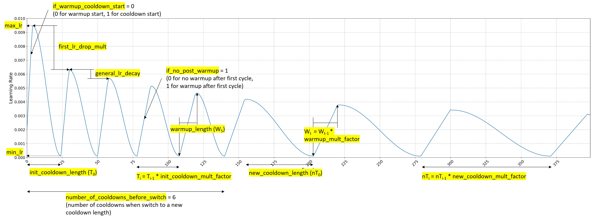

# Implementation of a custom learning rate scheduler based on "Stochastic Gradient Descent with Warm Restarts" method
This repository includes a custom Keras callback to be used in training that allows the implementation of cyclical learning rate policie as detailed in Leslie Smith's paper [Cyclical Learning Rates for Training Neural Networks
arXiv:1506.01186v4](https://arxiv.org/abs/1506.01186 "Title"). 

## How to use?
The custom Keras callback is available in a Python file [SGDR_custom.py](./src/SGDR_custom.py). You can directly import this callback into your code for use during the training process.

## Visualization of Learning Rate Schedule
To help you plan the parameters of the learning rate policy, a Jupyter Notebook is available under [LRS_plot.ipynb](./TEST/LRS_plot.ipynb). This notebook allows you to visualize the learning rate schedule, providing insights into how the learning rate will change across epochs.

## Parameters:
- **min_lr (float):** Minimum learning rate during the entire training.
- **max_lr (float):** Maximum learning rate before each restart.
- **steps_per_epoch (int):** Number of steps per epoch. Is equal to number of training samples divided by batch size. = ceil(num_samples / batch_size)
- **first_lr_drop_mult (float):** Drop factor for learning rate after the first warmup.
- **general_lr_decay (float):** Decay factor for learning rate.
- **if_warmup_cooldown_start (int):** 0 for warmup start, 0 for cooldown start. Decide whether to start with warmup or cooldown step.
- **init_cooldown_length (int):** Initial number of epochs in a cooldown step.
- **init_cooldown_mult_factor (float):** Factor to grow the cooldown step length.
- **warmup_length (int):** Number of epochs in warmup period.
- **warmup_mult_factor (float):** Factor to grow the warmup length.
- **if_no_post_warmup (int):** 0 for no post warmup, 1 for post warmup. Decide whether to have post warmup step, i.e. after first warmup.
- **number_of_cooldowns_before_switch (int):** Epoch to switch to a new cooldown length.
- **new_cooldown_length (int):** New cooldown length after switch epoch.
- **new_cooldown_mult_factor (float):** Factor to grow the new cooldown length.
- **verbose (int):** Verbosity mode.

ParametersSGDR.jpg



## References
  1. **CyclicalLR:** Cyclical Learning Rates for Training Neural Networks: https://arxiv.org/pdf/1506.01186.pdf;
  2. **CosineLR:** SGDR: STOCHASTIC GRADIENT DESCENT WITH WARM RESTARTS: https://arxiv.org/pdf/1608.03983.pdf;

## Examples

### 1. Cosine annealing with initial warmup, decaying max-lr and increasing warmup length. Fixed length for cycles.
```python
sgdr = SGDRScheduler_custom(
    min_lr=0.0001, 
    max_lr=0.01, 
    steps_per_epoch=68,
    first_lr_drop_mult=1,
    general_lr_decay=0.95, 
    if_warmup_cooldown_start=0,
    init_cooldown_length=30,
    init_cooldown_mult_factor=1.1,
    warmup_length=10,
    warmup_mult_factor=1.2,
    if_no_post_warmup=1,
    number_of_cooldowns_before_switch=0,
    new_cooldown_length=30,
    new_cooldown_mult_factor=1.1,
    )
```

### 2. Cosine annealing without initial warmup and constant max-lr. Fixed length for cycles.
```python
sgdr = SGDRScheduler_custom(
    min_lr=0.0001, 
    max_lr=0.01, 
    steps_per_epoch=68,
    first_lr_drop_mult=1,
    general_lr_decay=1, 
    if_warmup_cooldown_start=1,
    init_cooldown_length=30,
    init_cooldown_mult_factor=1,
    warmup_length=10,
    warmup_mult_factor=1,
    if_no_post_warmup=0,
    number_of_cooldowns_before_switch=0,
    new_cooldown_length=30,
    new_cooldown_mult_factor=1,
    )
```

### 3. Cosine annealing with initial warmup, 5 initial small cycles and decaying max-lr. Fixed length for initial small cycles and increasing length for followup cycles.
```python
sgdr = SGDRScheduler_custom(
    min_lr=0.0001, 
    max_lr=0.01, 
    steps_per_epoch=68,
    first_lr_drop_mult=1,
    general_lr_decay=0.95, 
    if_warmup_cooldown_start=0,
    init_cooldown_length=20,
    init_cooldown_mult_factor=1,
    warmup_length=10,
    warmup_mult_factor=1,
    if_no_post_warmup=0,
    number_of_cooldowns_before_switch=5,
    new_cooldown_length=40,
    new_cooldown_mult_factor=1.2,
    )
```

### 4. Cosine annealing with initial warmup, increasing warmup length, 5 initial small cycles and decaying max-lr. Fixed length for initial small cycles and increasing length for followup cycles. First cycle has 70% reduced max-lr.
```python
sgdr = SGDRScheduler_custom(
    min_lr=0.0001, 
    max_lr=0.01, 
    steps_per_epoch=68,
    first_lr_drop_mult=0.70,
    general_lr_decay=0.95, 
    if_warmup_cooldown_start=0,
    init_cooldown_length=20,
    init_cooldown_mult_factor=1,
    warmup_length=5,
    warmup_mult_factor=1.2,
    if_no_post_warmup=1,
    number_of_cooldowns_before_switch=5,
    new_cooldown_length=40,
    new_cooldown_mult_factor=1.2,
    )
```

